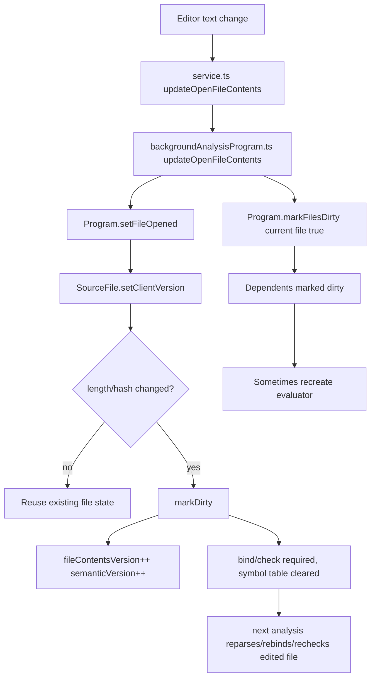

# Pyright Type Cache Between Edits

## Executive summary

Pyright does **not** rebuild its entire workspace state from scratch on every edit. In persistent modes — most importantly the language server, and also CLI watch mode — it keeps long-lived `Service`, `Program`, `SourceFileInfo`, and `SourceFile` objects in memory and performs “fast incremental updates when files are modified.” The repo’s internals doc describes a persistent in-memory service per workspace, and the features doc explicitly says watch mode performs fast incremental updates. citeturn26view3turn26view2

For an individual edited file, however, Pyright generally treats a text change as a **file-level invalidation** of parse/bind/check state, not as an AST-subtree patch. In `sourceFile.ts`, `setClientVersion` hashes the new contents and compares both length and hash against the previously seen contents; if they differ, it calls `markDirty()`. `markDirty()` increments `fileContentsVersion` and `semanticVersion`, marks binding and checking as needed, clears the module symbol table and line count, and fires a dirty event. `isParseRequired()` then forces a reparse whenever the analyzed contents version no longer matches the current contents version. citeturn15view2turn45view0turn17view0

So the practical answer is:

* **Per-file parse/bind/check results are reused only while the file contents remain unchanged.**
* **When a file’s text changes, that file’s parse/bind/check state is invalidated and recomputed on next analysis.**
* **Project-wide and resolver-level structures are often reused across edits**, including the `Program`, import-resolution caches, filesystem/typeshed caches, and the dependency graph, unless a broader invalidation event occurs. citeturn26view3turn42view0turn40view0

Pyright also has a separate in-memory **type-evaluator cache**. The repo’s issues describe it as an aggressive cache of types already evaluated for parse nodes, including a “speculative type cache.” Some edits or dirtying operations cause the `Program` to create a new evaluator, which effectively discards that cache; memory pressure can also flush type caches via `CacheManager.emptyCache()`. But the exact internal key structure of the evaluator’s cache was **not fully specified in the inspected sources**, so that portion should be treated as only partially documented from primary sources. citeturn39search0turn29search0turn22view1turn7view3

## Relevant implementation map

The repo’s `docs/internals.md` is the best architectural starting point. It says a persistent service owns a `Program`, the `Program` tracks source files being analyzed, and each `SourceFile` tracks the status of analysis plus intermediate/final results and diagnostics. It also states that the program updates as files are added, deleted, or edited, and prioritizes open files and their dependencies. citeturn26view3

The most relevant source files for cache behavior between edits are these:

| File | Main classes and methods | Why it matters |
|---|---|---|
| `packages/pyright-internal/src/analyzer/sourceFile.ts` | `WriteableData`, `setClientVersion`, `markDirty`, `markReanalysisRequired`, `isParseRequired`, `parse`, `bind`, `check`, `dropParseAndBindInfo` | Per-file cached analysis state and invalidation rules. citeturn15view0turn17view0turn16view0turn15view4turn15view5 |
| `packages/pyright-internal/src/analyzer/program.ts` | `Program`, `setFileOpened`, `setFileClosed`, `markFilesDirty`, `markAllFilesDirty`, `updateChainedUri`, `exitEditMode` | Workspace/program graph, dirty propagation, evaluator recreation. citeturn11view0turn18view5turn9view0 |
| `packages/pyright-internal/src/analyzer/backgroundAnalysisProgram.ts` | `BackgroundAnalysisProgram`, `updateOpenFileContents`, `markFilesDirty`, `startAnalysis` | Language-server/background-worker path for edits. citeturn34view0turn34view2turn34view3 |
| `packages/pyright-internal/src/analyzer/sourceFileInfo.ts` | `SourceFileInfo`, `_cachePreEditState`, `restore` | Edit-mode snapshotting and restoration. citeturn36view3 |
| `packages/pyright-internal/src/analyzer/cacheManager.ts` | `CacheManager`, `registerCacheOwner`, `getCacheUsage`, `emptyCache`, `pauseTracking`, `getUsedHeapRatio` | Memory-pressure-driven cache flushing. citeturn21view0turn22view0turn22view1 |
| `packages/pyright-internal/src/analyzer/importResolver.ts` | `ImportResolver`, `invalidateCache`, cached import lookups, shared FS/typeshed caches | Workspace-level import/libraries cache reuse and invalidation. citeturn40view0turn42view0turn42view2 |

The language-server-facing path is especially important. `service.ts` passes `changedRange?` into `BackgroundAnalysisProgram.updateOpenFileContents`, which forwards the call to `Program.setFileOpened`, and then explicitly marks the file dirty by calling `markFilesDirty([uri], true)`. That is the core “text changed” path for open-editor edits. citeturn35view0turn35view1turn34view0turn34view2

## What Pyright actually stores in cache

The closest thing to a formal inventory is `SourceFile.WriteableData`. It stores, among other things, a diagnostic version, file-content version, semantic version, last seen content length and hash, open-document contents and client version, analyzed contents version, parse tree cleaning flag, parsed file contents, tokenizer lines/output, line count, module symbol table, import metadata, and parser output. In other words, the per-file cache covers the AST and tokenization products, import-resolution results, symbol-table root for the module, and flags tracking whether binding or checking must be rerun. citeturn15view0turn15view1

That per-file state corresponds closely to the categories in your prompt:

* **Per-file AST / parse state**: `parserOutput`, `parsedFileContents`, `tokenizerLines`, `tokenizerOutput`, `lineCount`. citeturn15view0turn16view0turn17view0
* **Semantic model / symbol tables**: `moduleSymbolTable`, plus binder-generated scope data attached to the parse tree when binding runs. During binding, Pyright builds file info, attaches it to the parse tree, runs `Binder.bindModule`, and stores the module scope’s symbol table. citeturn15view0turn15view4
* **Type-checking state**: binding/checking flags, diagnostics buckets, check time, and the checker run over the existing `parserOutput`. citeturn15view1turn15view5
* **Incremental analysis state**: `fileContentsVersion`, `semanticVersion`, `analyzedFileContentsVersion`, `parseTreeNeedsCleaning`, plus booleans like `isBindingNeeded` and `isCheckingNeeded`. Those are the main invalidation/reuse levers. citeturn15view0turn15view1turn17view0

A few details are especially important for reuse. `getParseResults()` returns cached parse results only if `isParseRequired()` is false; otherwise it returns `undefined`. When parse results are returned, tokenizer output may itself be lazily generated on demand if it is no longer resident, meaning Pyright can retain parse-tree-level state while omitting some heavier tokenization data except for open files. citeturn17view0turn14view2

Pyright explicitly limits how much tokenization state it retains in memory. After parsing, it caches `tokenizerOutput` **only if the file is open** in the client. When a file is closed, `setClientVersion(null, '')` drops `tokenizerOutput` to save memory. This means some parser-adjacent data is sticky primarily for open files, whereas closed files may keep less materialized text/token state. citeturn16view0turn15view2

Outside the per-file state, there are workspace-level caches in `ImportResolver`. These include `_cachedImportResults`, `_cachedModuleNameResults`, parent-directory import-resolution caches, a filesystem cache (`importResolverFileSystem`), and a typeshed info provider. The constructor comments explicitly say the file-system and typeshed providers can be supplied through the `ServiceProvider` to share caching across resolver/typeshed operations and avoid repeated filesystem walking. citeturn41view1turn42view0

There is also a distinct **type-evaluator cache**. The primary source evidence here is mostly issue commentary rather than the inspected evaluator source itself: maintainers describe Pyright as aggressively caching previously evaluated types for parse nodes and maintaining a “speculative type cache.” Another issue refers to an “in-memory type cache” that can grow large for performance reasons. Those statements align with the presence of `CacheManager` and the explicit “Emptying type cache to avoid heap overflow” logs, but the exact in-repo data structures and keys for those evaluator caches were not fully established in this pass. citeturn39search0turn29search0turn29search5turn22view1

## How cache keys and invalidation work across edits

For edited source text, the clearest key is **file identity plus content generation**, not edit-range identity. `SourceFile.setClientVersion` records the client version and contents, computes a content hash, compares current length and hash against the prior values, and calls `markDirty()` if either changed. That tells us the per-file cache is effectively keyed by the file’s URI plus the latest content generation, with fast change detection based on content length and hash. citeturn15view2turn14view5

Once `markDirty()` runs, Pyright increments both `fileContentsVersion` and `semanticVersion`, invalidates “no circular dependency confirmed,” sets both binding and checking back to required, clears the module symbol table and line count, and fires a dirty event. The parse cache is then considered stale because `isParseRequired()` returns true whenever `analyzedFileContentsVersion !== fileContentsVersion`. In practice, that means an actual text change forces the edited file to be reparsed and rebound/rechecked the next time analysis touches it. citeturn45view0turn17view0

By contrast, if the client sends the same contents again, `setClientVersion` does **not** call `markDirty()`, because the length and hash match. So file-level parse/bind/check state is reused when text is unchanged. This is the closest thing Pyright has here to a stable reuse key: unchanged content means unchanged content generation. citeturn15view2

A second, lighter invalidation path is `markReanalysisRequired(forceRebinding)`. It increments only `semanticVersion`, sets checking required, and leaves parse info intact. Rebinding is requested only when the file already has parse output and one of these holds: the file contains a wildcard import, it has `__all__` information attached to the parse tree, or the caller forces rebinding. In that case Pyright marks the parse tree as needing cleaning, sets binding required, and clears the module symbol table. This is a **reuse-oriented** path: it tries to preserve parse results while restarting downstream semantic analysis. citeturn17view0

That distinction is the central answer to “rebuilt or reused?”:

* **Text changes** usually go through `markDirty()` and therefore invalidate the edited file’s parse/bind/check state. citeturn15view2turn45view0
* **Dependency-induced semantic changes** can go through `markReanalysisRequired()`, which preserves parse results and only restarts later analysis phases, with optional rebinding in wildcard / `__all__` cases. citeturn17view0

The normal editor path in the language server is not keyed by edit ranges. `service.ts` accepts an optional `changedRange`, passes it through `BackgroundAnalysisProgram.updateOpenFileContents`, and that forwards the options into `Program.setFileOpened`. But the inspected `Program.setFileOpened` path ultimately just calls `sourceFile.setClientVersion(version, contents)`, whose signature uses only the version and full contents. In the inspected sources, I did **not** find a place where `changedRange` affected cache keys, parse reuse, or invalidation scope. So as of the inspected revision, **file path + content generation/hash** is clearly used; **edit-range keying is present at the API surface but unspecified or unused in the inspected implementation path**. citeturn10view0turn35view0turn34view0turn11view0turn15view2

The dependency graph matters for broader invalidation. When files are marked dirty through program-level APIs, Pyright also “marks any files that depend on this file as dirty” so they will be reanalyzed, and then may create a new evaluator. This behavior appears in `markAllFilesDirty`, `markFilesDirty`, `setFileClosed` when on-disk contents changed, and `updateChainedUri`. Pyright also special-cases `builtins.pyi` and `__builtins__.pyi`: changes there cause all files to be marked dirty. citeturn18view5turn44view1turn11view0

The evaluator-level cache gets broader invalidation under several conditions. The inspected `Program` code recreates the evaluator when config options change, when the import resolver changes, when dirty propagation requires it, and when exiting edit mode — where the source explicitly says “All cache is invalid now.” That means type-evaluator cache entries are **not** guaranteed to survive all edits; they are sometimes thrown away wholesale. citeturn8view3turn9view0

The following table summarizes the observed cache behavior.

| Situation | Edited file parse tree | Edited file symbol table | Dependent files | Evaluator/type cache | ImportResolver caches |
|---|---|---|---|---|---|
| Open-file update with identical text | Reused; `markDirty` is not called. citeturn15view2 | Reused. citeturn15view2turn17view0 | Not dirtied by content hash path alone. citeturn15view2 | Likely reused; no explicit evaluator recreation on identical text in inspected path. Exact fine-grained keying is unspecified. citeturn15view2turn7view3 | Reused. citeturn42view0 |
| Open-file update with changed text | Invalidated; next analysis reparses because `fileContentsVersion` changes. citeturn45view0turn17view0 | Invalidated; module symbol table cleared and binding required. citeturn45view0 | Marked dirty through `markFilesDirty`, so reanalysis can propagate. citeturn34view2turn44view1 | May be partially reused or may be recreated depending on dirty propagation; exact per-entry invalidation path is unspecified in inspected sources. citeturn34view2turn7view3 | Reused unless separately invalidated. citeturn42view0 |
| Semantic-only dependency change | Parse tree can be reused via `markReanalysisRequired`; rebinding only for wildcard / `__all__` / force. citeturn17view0 | Invalidated only when rebinding is needed. citeturn17view0 | Reanalysis propagates by dependency graph. citeturn44view1 | Can be recreated in some program-level dirty paths. citeturn9view0 | Usually reused. citeturn42view0 |
| Config or import-resolver change | Existing per-file data may survive, but analysis is restarted under a new evaluator/import context. citeturn8view3turn42view0 | May need recomputation under new settings. citeturn8view3turn42view0 | Workspace-wide effects possible. citeturn8view3turn42view0 | Explicitly recreated. citeturn8view3 | Explicitly invalidated in `ImportResolver.invalidateCache()`. citeturn42view0 |
| Memory pressure | Parse/bind info can be dropped and later rebuilt. citeturn17view0 | Dropped with parse/bind info. citeturn17view0 | Recomputed on demand. citeturn17view0 | Cache manager can empty type cache to avoid heap overflow. citeturn22view1turn29search5 | Not the main target of the type-cache flush, but resolver caches have their own invalidation path. citeturn42view0 |

## Incremental edits, partial reanalysis, and workspace-level caches

Pyright’s incremental behavior is **file-granular and dependency-aware**, not text-range-granular in the inspected path. The repo docs say the binder builds scopes and the reverse code-flow graph, and the checker relies heavily on the type evaluator. `SourceFile` then tracks exactly which phases are required for a file. That design supports partial reanalysis at the level of “re-parse this file, maybe rebind these dependents, recheck only what is dirty,” rather than “surgically patch the AST after a local edit.” citeturn26view3turn17view0

The language server uses a `BackgroundAnalysisProgram` wrapper. On open-file edits it updates both background and foreground program state, marks the edited file dirty, and starts the analysis loop. This is the primary mode in which “between edits” cache reuse matters, because the process and workspace service stay alive. The internals doc also states that for multi-root workspaces, each workspace gets its own service instance. citeturn34view0turn34view2turn34view3turn26view3

Edit mode is a separate mechanism used when Pyright performs synthetic or temporary mutations. `SourceFileInfo` snapshots writable state on first mutation in edit mode, and `restore()` later reinstates the prior snapshot and forces parse/bind info to be recalculated. `Program.exitEditMode()` then says “All cache is invalid now” and recreates the evaluator. So edit mode is effectively a transactional overlay, not a normal persistent incremental-edit strategy. citeturn36view3turn8view3

Workspace-level caches extend beyond source files. `ImportResolver` stores cached import results and module-name resolutions, plus a parent-directory cache. It also uses a filesystem cache and a typeshed info provider that can be shared through the service provider. Those caches are not normally invalidated by ordinary source-text edits; they invalidate when the resolver is reset, config options change, or `invalidateCache()` is called. `invalidateCache()` clears cached import results, module-name results, parent-directory cache, stdlib-module memoization, filesystem cache, and partial-stub state. citeturn41view1turn42view0turn42view2

There is one subtle configuration/Python-version wrinkle worth calling out. In `importResolver.ts`, the stdlib-module cache is described as being built lazily and memoized until `invalidateCache()`, “without keying on the execution environment,” even though the directory-backed gating is Python-version and platform sensitive. That means Python-version/platform-sensitive library cache behavior depends on resolver invalidation when config/execution-environment inputs change. citeturn41view0

Mode differences are therefore straightforward. The language server and watch mode benefit from persistent in-memory structures and incremental dirtiness tracking. By contrast, a normal one-shot CLI invocation starts a fresh process and therefore does not preserve in-memory caches **across separate CLI runs**; that is an inference from the architecture, whereas the repo’s explicit “persistent service” wording is targeted at the language-server side. Both modes, however, share the same analyzer modules and `Program`/`SourceFile` machinery once running. citeturn26view3turn26view2

## Reproducible experiment and what to look for

A simple way to observe the behavior is to use a persistent mode and compare first analysis versus edit-triggered analysis. The features doc confirms that watch mode performs incremental updates, and the internals doc explains that the `Program` prioritizes open files and their dependencies. citeturn26view2turn26view3

Create a small project with `a.py` importing `b.py`, plus a variant where `b.py` defines `__all__` or uses a wildcard import. Start Pyright in watch mode or use the language server. Then make these edits:

1. Re-send identical contents for `b.py`.
2. Change a comment or whitespace in `b.py`.
3. Change an exported name in `b.py`.
4. Change `b.py` so it affects wildcard import resolution or `__all__`.

What you should expect, based on the source:

* Case 1 should largely reuse state because `setClientVersion` will see identical length/hash and skip `markDirty()`. citeturn15view2
* Case 2 still counts as a content change, so the edited file will be marked dirty, reparsed, rebound, and rechecked on demand. The current path does not use `changedRange` for a narrower invalidation. citeturn15view2turn17view0turn35view1
* Case 3 should also dirty dependents via `Program.markFilesDirty`, because dependent files are recursively dirtied when a source file changes. citeturn34view2turn44view1
* Case 4 is where `markReanalysisRequired(forceRebinding)` matters most: wildcard imports and `__all__` force rebinding because a dependency’s exported surface may have changed. citeturn17view0

If you want direct evidence in a local checkout, the most reliable test is to temporarily instrument these methods with logging: `SourceFile.setClientVersion`, `SourceFile.markDirty`, `SourceFile.markReanalysisRequired`, `SourceFile.parse`, `SourceFile.bind`, `Program.markFilesDirty`, and the points where `Program` calls `_createNewEvaluator()`. Those are the hot spots that determine whether Pyright is reusing or discarding analysis state between edits. The relevant file paths and line ranges are listed above. citeturn15view2turn45view0turn17view0turn16view0turn15view4turn34view2turn9view0

## What is still unspecified

Several things are clear from the inspected primary sources. Pyright keeps persistent per-workspace structures in language-server/watch scenarios; it keys file-change detection off file identity plus content length/hash; it tracks file and semantic generations; it reparses changed files rather than applying an in-place AST edit patch; it has separate resolver caches; and it can flush type caches under memory pressure. citeturn26view3turn15view2turn17view0turn42view0turn22view1

What is **not fully specified** in the inspected source set is the exact internal key structure for the **type evaluator’s cache entries**. Maintainer comments in issues say the evaluator caches previously computed types for parse nodes and maintains a speculative type cache, but I did not inspect the relevant evaluator source deeply enough in this pass to prove whether those entries are keyed by parse node identity, semantic version, file version, or a combination thereof. That part should therefore be treated as **partially documented by issues, not fully established by direct source inspection here**. citeturn39search0turn29search0

Likewise, the optional `changedRange` plumbing is present in the API surface, but in the inspected edit path it is passed through without affecting the final `setClientVersion(version, contents)` invalidation decision. I therefore would **not** describe edit ranges as an active cache key for ordinary text edits in the current inspected revision. The safer wording is: **edit-range-based incremental invalidation is unspecified or unused in the inspected implementation path**. citeturn35view0turn34view0turn11view0turn15view2

For issue and history context, the most relevant public clarifications I found were these: issue **#4950** on speculative type caching, issue **#5931** on the large in-memory type cache, issue **#3050** on heap-limit assumptions for the type cache, and issue **#5202** showing that clearing the type cache can materially affect diagnostics. Those are useful companion references when reading the implementation. citeturn29search0turn29search5turn29search2turn29search6